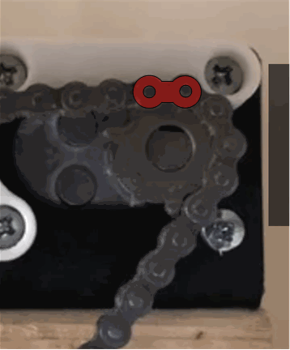

# Set Sprockets & Reset Chains

Release: >0.906
{: .label .label-blue }

### Description
This function allows you to test whether one (or both) of your chains have skipped on the sprocket.  The use of this function requires that you have marked the chain link that was on the top tooth of the sprocket after you extended the chains to connect them to the sled.

See:  [Set Sprockets & Reset Chains]({{ site.baseurl }})

### Process

The sled will be moved such that the length of each chain equals the 'Extend Chain Distance' (found in Advanced Settings).  If you marked the chain link on the top tooth of the sprocket when you set/reset your chain lengths, this chain link should be on the top tooth.  If the link is not, then your chain has skipped a tooth... or more.

### Troubleshooting

|Result   	|Possible Cause/Solution   	|
|---	|---	|
|Marked link is NOT on top tooth.   	|You chain has skipped.  You need to reset chain lengths and look for solutions to prevent further chain skips.  Check the alignment of the motors and the sled to make sure they are all in the same plane.   	|
|xxxx   	|xxxx.   	|

