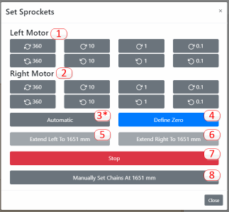

# Set Sprockets Vertical / Reset Chains

Release: >0.906
{: .label .label-blue }

### Description
This function allows the user to reset chain chains by setting a tooth on each sprocket vertical, installing the chains on the teeth, and extending the chains a specific distance to allow the chains to be attached to the sled.

### Process
The process of resetting the chains involves two steps; first, each sprocket has one tooth placed as perfectly vertical as possible and then, second, the chains are extended by a specific length.

If the user follows these directions the first time they set the chain lengths, future chain lengths can be done quicker using the optional Quick Way.

##### The Long Way #####

If this the the first time setting the chains, then you will need to do it the long way.

Step 1) Set left sprocket vertical.  Use the clockwise/counterclockwise buttons to rotate the sprocket (Button Set 1).

Step 2) Repeat for right sprocket (Button Set 2).

_Sprocket with Vertical Tooth_

Step 3) Press 'Define Zero' (Button 4).

Step 4) Install Chains.  Install the chains on the sprocket such that the first link is resting on the top sprocket tooth. The placement depends on if you built the frame for 'Chains Off Top' or 'Chains Off Bottom'

_Chains Off Bottom_

_Chains Off Top_

Step 5) Extend Left Chain. Press ‘Extend Left Chain to xxxx mm’ (Button 5). Warning: This is one spot where the chains can get wrapped around the sprocket. Grab hold of the end of the chain and apply tension to it as it feeds off the sprocket so it doesn’t wrap.

Step 6) Extend Right Chain. Press ‘Extend Right Chain to xxxx mm’ (Button 6).  Warning: Same as above.

Step 7) Connect Sled. Connect up your sled to the extended chains. 

Step 8) Mark chains. This step is to allow you to use the Quick Way of resetting the chains.  Take a marker, nail polish, something, and mark the specific chain link that is on top of the top tooth. If the ‘Extend Chain Distance’ is a multiple of 6.35 mm, there should be a tooth perfectly vertical after extending the chains. Mark this because if you ever have to reset the chains, you need to know which link is this one.

Your chains are now reset!  **Note: It is unlikely that your sled is in the center of the board.  It should be centered horizontally, but likely is not centered vertically.  That's ok.  The machine knows where its at and if you look at the main screen, the red reticle should show the sled to be where it is actually located.  If not, then something went wrong.**

##### The Quick Way #####

If you perfomed Step 8 above when you first set your chains, you know which link was on the vertical tooth of each motor when the chains were extended to a specific distance.  Because of this, all you need to do to reset the chain lengths is to set a tooth of each sprocket vertical, reapply the marked link back onto that tooth, and tell the machine the chains are reset...

Step 1) Set left sprocket vertical.

Step 2) Repeat for right sprocket.

Step 3) Install Chains.  Place the chain link that's been marked back on the top tooth of each motor.

Step 4) Connect Sled.  Connect up your sled to the extended chains.

Step 5) Press 'Manually Set Chains At xxxx mm' (Button 8).  This tells the controller that the chains are extended a distance of xxxx mm (where xxxx is the Extend Chain Length setting).  The controller now knows the lengths of the chains and therefore the position of the sled.

Your chains are now reset!  **Note: To repeat the note above, it is unlikely that your sled is in the center of the board.  It should be centered horizontally, but likely is not centered vertically.  That's ok.  The machine knows where its at and if you look at the main screen, the red reticle should show the sled to be where it is actually located.  If not, then something went wrong.**

 
### Troubleshooting

|Result   	|Possible Cause/Solution   	|
|---	|---	|
|xxxx   	|xxxx.   	|
|xxxx   	|xxxx.   	|

