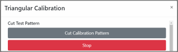
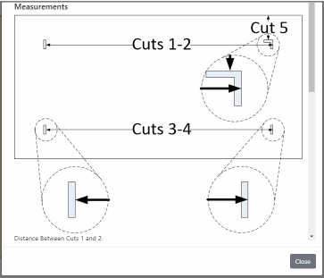
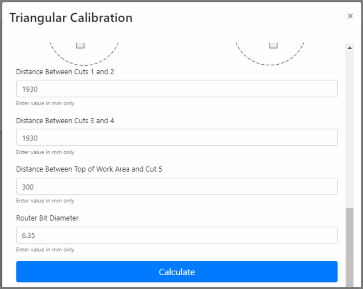
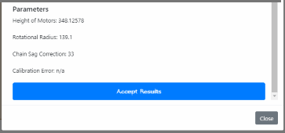

# Triangular Calibration

Release: >0.906
{: .label .label-blue }

If you are using stock firmware, use 'Actions->Holey Calibration' to calibrate.  If using holey calibration firmware, go here:
 
 [Holey Calibration](Actions/Calibration-Setup/holeyCalibration.md)

### Step 1: Cut Pattern 

Press 'Cut Calibration Pattern' and wait for the sled to complete the cutting.

### Step 2: Measure
 
Make and record your measurements as requested.  Double check and triple check them.. seriously.. do it.

### Step 3: Enter Measurements

Enter the measurements and double and triple check you entered them correctly and in the correct units.  If so, press 'Calculate'

### Step 4: Accept Results

If all looks good, press 'Accept Results' (you may have to scroll down the screen to see it)|

### Step 5: Dance a Jig

You're calibrated!  Note, calibration can be an iterative process and some have found improvements in their Maslow's accuracy by calibrating a second time.  Make sure to recut the test pattern if you chose to calibrate again.
