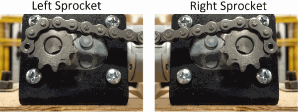
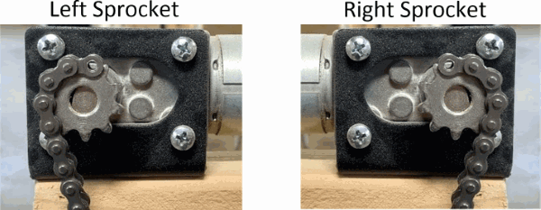

# First Steps

Release: >0.906
{: .label .label-blue }

## If you are coming from using GroundControl:

If you are coming from using GroundControl, my recommendation is to import your groundcontrol.ini file before proceeding any further.

Go to Actions->Import groundcontrol.ini

If all goes well and the comport assignment is still the same, you should be able to communicate with the controller.

## If you are starting anew:

### 1) Set ComPort

Go to Settings->Maslow Settings->COMPort and select the comport for the arduino controller.  Press the 'refresh' symbol to populate the list of available comports (give it a couple of seconds if you have a bluetooth enabled on the computer running webcontrol).  Don't forget to press submit.  If all goes well, you should see messages coming from the controller in the lower right portion of the screen (Controller Messages)

 

_COMPort Setting_

### 2) Set Distance to Extend Chains

If you are using a top beam that's longer than 10 feet, go to Settings->Advanced Settings->Extend Chain Distance.  If using a 12-foot beam, change to 2032.  This is the amount of chain that will be extended to allow you to connect up the sled.  Too little and they won't meet and too much, the sled may be on the floor.  You don't have to use a value that perfectly equates to the center of the board, just make sure it's a multiple of 6.35 mm.

_Extend Chain Distance_

### 3) Quick Configure

Go to Actions->Quick Configure and enter the requested information.  This lets the controller know enough about the setup to allow you to calibrate the machine.  Don't forget to press submit.

### 4) Set Sprockets Vertical

Go to Actions->Set Sprockets & Reset Chains:

4a) Get one tooth of each sprocket as precisely vertical as you can using the buttons.  When done, press 'Define Zero'.  This tells the controllers that the chain length is 0. 

_Sprocket with Vertical Tooth_

4b) Install the chains on the sprocket such that the first link is resting on the top sprocket tooth. The placement depends on if you built the frame for "Chains Off Top" or "Chains Off Bottom" 

_Chains Off Bottom_

_Chains Off Top_

4c) Extend left chain. Press 'Extend Left Chain to xxxx mm' where xxxx is the distance set in Step 2.  Warning: This is one spot where the chains can get wrapped around the sprocket.  Grab hold of the end of the chain and apply tension to it as it feeds off the sprocket so it doesn't wrap.

4d) Extend right chain. Press 'Extend Right Chain to xxxx mm' where xxxx is the distance set in Step 2.  Warning: Same as above.

4e) Connect Sled.  Connect up your sled to the extended chains.

4f) Mark chains.  Take a marker, nail polish, something, and mark the specific chain link that is on top of the top tooth.  If the 'Extend Chain Distance' is a multiple of 6.35 mm, there should be a tooth perfectly vertical after extending the chains.  Mark this because if you ever have to reset the chains, you need to know which link is this one.

### 5) Calibrate

If using stock firwmare, go to:
 
 [Triangular Calibration]({{ site.baseurl }})
 
If using holey calibration firmware, go to:

 [Holey Calibration]({{ site.baseurl }})
