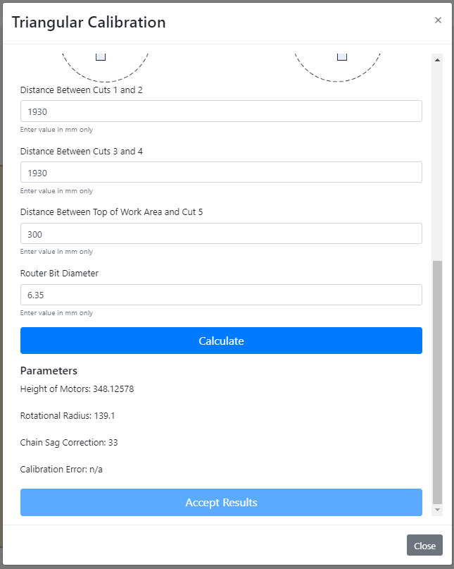

# Triangular Calibration

If you are using stock firmware, use 'Actions->Triangular Calibration' to calibrate.  If using holey calibration firmware, go here(add link)

|test|test|
|---|---|
|   |   1) Press 'Cut Calibration Pattern' and wait for the sled to complete the cutting.|
|   |   2) Enter the measurements as requested |
|   |   3) Press 'Calculate'|

4) If all looks good, press 'Accept Results' (you may have to scroll down the screen to see it)

5) Dance a jig.  You're calibrated.
