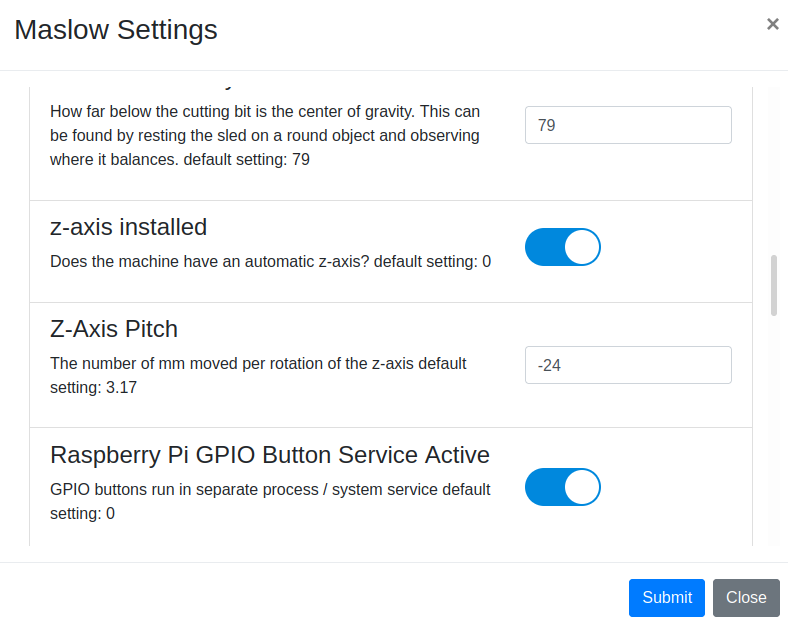

##### Input and Indicators

######LED's

Light Emitting Diodes (LED's) can be useful to indicate machine status.  Red can mean running / busy or stopped.  Green can mean ready or running.  With a raspberry pi and webcontrol, the GPIO can be used to indicate the system state:  Run, Pause, Stop.  

In order for GPIO buttons or indicators to work, the GPIO Button service must be activated.  Click the webcontrol menu "Settings -> Maslow Settings" and then scroll down to the "Raspberry Pi GPIO Button Service Active" option and toggle the slider to the ON position.

The raspberry pi GPIO can be set as LED outputs.  Simply connect the wire to your LED to the 40 pin header.  An illustruation of the header pins is included in the page where the pin selections can be made.  In Webcontrol, from the menu, select "Settings->GPIO Settings" and you will see:

NOTE:  For the LEDs to work, the GPIO Service must be activated.  It can be started, stopped or restarted at the top of the GPIO Settings window.  It is found in the /usr/local/etc/and is named MaslowButton.py.  The service name is MaslowButton.service and can be command-line modified with $sudo systemctl (start|stop|restart|enable|disable) MaslowButton

Click the drop down menu for the pin you connected and select the desired indication.  There are only 6 LED options:
playLED - turns on when the gcode is running
pauseLED - turns on when the gcode is paused
stopLED - turns on when the gcode stops
tri_color_red - red led connection of a 3-in-1 led 
tri_color_green - green led connection of a 3-in-1 led
tri_color_blue - blue led connection of a 3-in-1 led

The 3-on-1 led can be used to make many colors by turning one or more emitters on at the same time.  The code does not support pulse width modulation, so there are really only 7 colors:
red, green, blue, red+green, red+blue, green+blue, red+green+blue.  If using the tricolor LED, then it must be enabled in the Settings -> Maslow Settings menu by scrolling down to "Status Indicator is Tricolor LED" and toggling that selection to ON.

Once enabled, the "Settings->LED Indicator Settings" menu will have significance:

simply select the color option that you want to correspond with the available machine conditions and your tricolor LED will tell you what that machine is doing.

