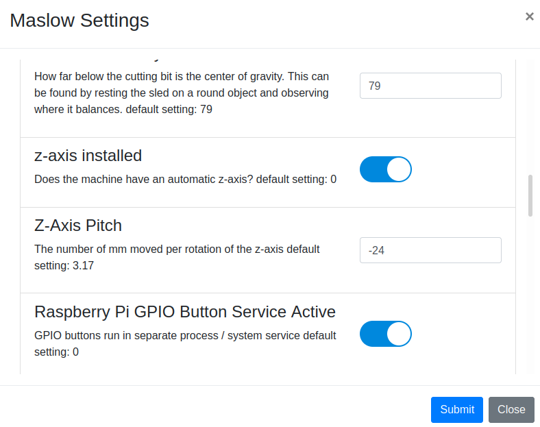
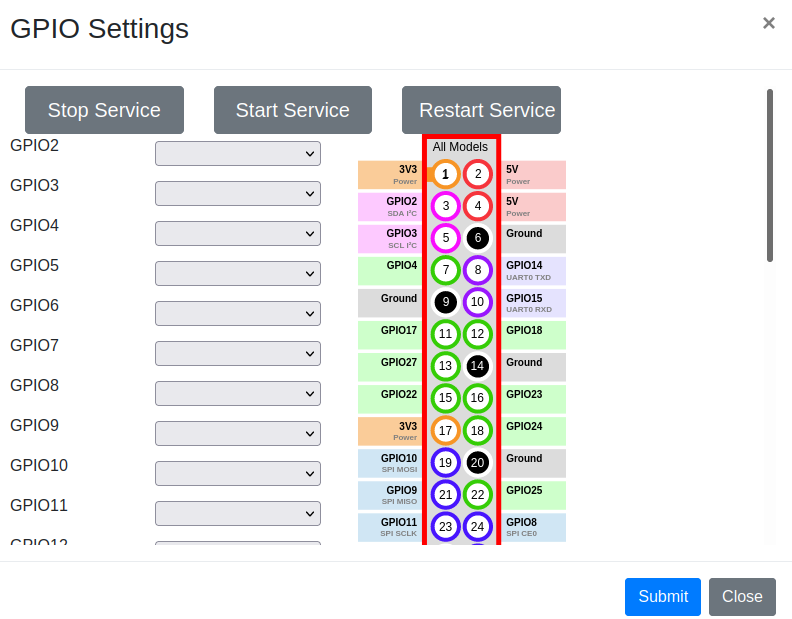

##### Input and Indicators

######Buttons

Buttons as input for Webcontrol can be useful to to prepare the system and change its operational state.  

In order for GPIO buttons or indicators to work, the GPIO service must be activated.  Click the webcontrol menu "Settings -> Maslow Settings" and then scroll down to the "Raspberry Pi GPIO Button Service Active" option and toggle the slider to the ON position.

A simple button can connect a GPIO pin to ground.  In order for button presses to be picked up , a separate button service script must run on the raspberry pi.  It can be started and stopped with the buttons found top of the page shown when selecting the menu "Settings-> GPIO Settings."

Once a button is wired to the raspberry pi GPIO pins, its function must be assigned in the GPIO settings menu shown above.  Click on the drop down list for the pin and select the button's function.  The functions available include:

spindle on - turn on spindle or router with M3/M4 command
spindle off - turn off spindle or router with M5 command
shutdown - shut down raspberry pi - can be done a couple other ways as well.
stop - stop executing gcode
pause - pause the execution of gcode
play - start executing gcode
set home - set the current sled position as home
go home - move sled to the current home position
return to center - move the sled to the system center