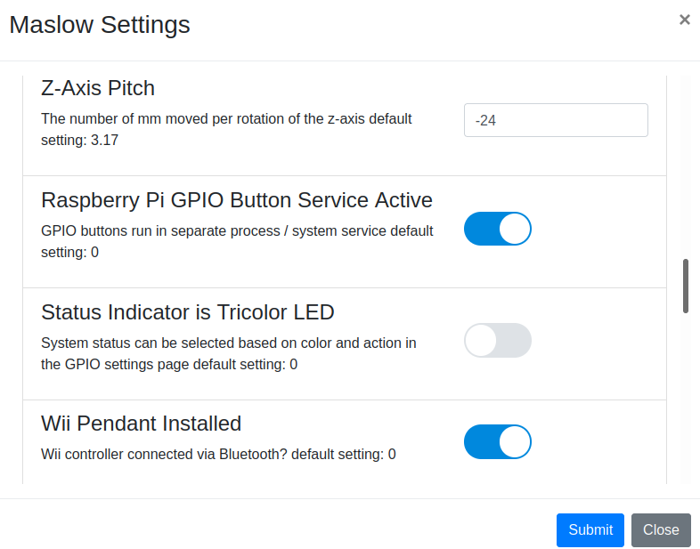

#### Input and Indicators

######Wii remote - wiimote - wii controller (not nun chuck)

The Wii remote communicates via bluetooth.  A working remote will flash all 4 status buttons when buttons 1 & 2 are pressed together.  This initiates the pairing sequence.  If the wii is not nearby, other devices can connect to the wii controller while it is in pairing mode.  

In order for the raspberry pi to be in the right mode to pair, the wii remote service must be activated.  Click the webcontrol menu "Settings -> Maslow Settings" and then scroll down to the "Wii Pendant Installed" option and toggle the slider to the ON position.

A separate button on the raspberry pi is used as a pairing button.  Press the pairing button on the raspberry pi, then press the pairing sequence on the wii remote and when the remote pairs, it will rumble twice and then show only one LED indicator.

Once paired, the wii remote is intended to be used in 2 handed mode held horizontally with the digital pad on the left and the buttons on the right.  

Up, down, left and right will be correct in this orientation.  By combinding button presses, the controller will issue commands to the raspberry pi script that then get trasmitted over the wifi to WebControl and on to the mega to move the sled, set home, move Z, set Z zero, start gcode execution (play), pause gcode execution, resume gcode execution, or stop gcode execution, or unpair.  There are also commands to change the distance moved.

X-Y sled movement moves the direction of the digital pad the distance s

UP:     1 + Up
LEFT:   1 + Left
RIGHT:  1 + Right
DOWN:   1 + Down
Go HOME: Home button
Set HOME: 1 + Home then A

Z Sled movment

Retract:  2 + Up
Plunge:   2 + Down
Set Zero: 2 + Home then A

Play: Z + Up
Pause: Z + Left
Resume: Z + right
Stop: Z + Down

Disconnect wiimote: A + Z

Select distance (mm) toggles through these values and displays battery status light to indicate:
X-Y   Z
1    0.1   Top light
10   0.5   second from top
100   1    next to bottom
300   5    bottom light  