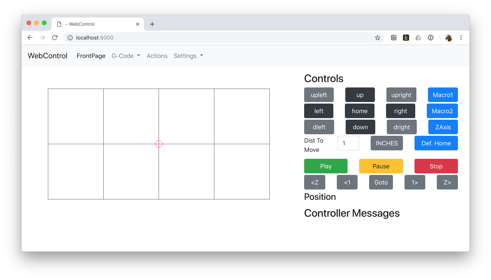

# WebControl

The official tool for [Maslow CNC](https://www.maslowcnc.com/); control your Maslow with any web browser.

* Browser-based, multi-platform controller software.
* Connects to Maslow's Arduino Mega (or similar) via USB.
* Includes setup instructions (updated from [Maslow Community Garden](http://maslowcommunitygarden.org/)).
* Runs gcode (`.nc` files) for printing cuts.

You can [report issues](https://github.com/WebControlCNC/WebControl/issues) to the [volunteer team](https://github.com/WebControlCNC/WebControl/).

## Context

WebControl started as a browser-based port of the original GroundControl application, but has grown to support more features:

* The calibration and setup process is better documented and easier to use.
* It implements a flask+socketio web server, so other computers on the network may control the machine.
* It can be run on a low-cost device, like a Raspberry Pi.
* It can also support multiple custom firmwares developed by the community which enhance the Maslow.

At this point, WebControl has become the **de-facto beginner's tool for Maslow**.

## Installation

### Pre-Built Raspberry Pi Image

See the [dedicated repository](https://github.com/WebControlCNC/webcontrol-pi).

### Pre-Built Application Binaries

There are both single-file (installer) and single-directory (zipped) releases available. The installer files are appropriate for faster machines, like a Windows 10 laptop where an installer executable is desired. Zipped, "single-directory" releases will unpack faster and startup quicker on devices like the Raspberry Pi.

See the [releases page](https://github.com/madgrizzle/WebControl/releases) and choose the appropriate architecture and release type.

### Linux Autostart (systemd)

To run WebControl automatically on startup for a Linux-based machine, it is recommended to create a service:

>nano webcontrol.service

type the following:

>[Unit] 
>Description=WebControl 
>After=network.target 
> 
>[Service] 
>ExecStart=/home/pi/webcontrol/webcontrol 
>WorkingDirectory=/home/pi/webcontrol 
>StandardOutput=inherit 
>StandardError=inherit 
>Restart=always 
>User=pi 
> 
>[Install] 
>WantedBy=multi-user.target 

Save file using Ctrl-X/Yes

>sudo cp webcontrol.service /etc/systemd/system

Test with the following:

>sudo systemctl start webcontrol.service

Try to reach webcontrol using your browser.

To debug, try:

>sudo systemctl status webcontrol

Or, to. get logs:

>journalctl -xe

When it works, then type:

>sudo systemctl enable webcontrol.service

see for more details:
https://www.raspberrypi.org/documentation/linux/usage/systemd.md

### Docker & Kubernetes

* Pull the docker image from `inzania/web-control` using the `armv7` or `amd64` tag.
* Mount a data/config volume at `/root/.WebControl`
* Expose port `5000`
* Run with `privileged: true` security context for USB access.

### Remote Access

WebControl can be run behind a front-proxy with TLS termination, such as nginx. You can use this in conjunction with semi-static IP to access your Maslow from anywhere with internet access. The full scope of this is outside this documentation, so you should be sure you understand the **security implications** before proceeding (hint: WebControl doesn't have a login or user authentication system).

## Usage

Open your web browser to `localhost:5000` (or use the IP address of your device).

@ML1xi36LTCSSXHiCD8RsRQ Here's a good place to start onboarding peaple @

## Built With

* [Flask](http://flask.pocoo.org/) - The web framework used
* [Flask-Socketio](https://github.com/miguelgrinberg/Flask-SocketIO) - Websocket integration for communications with browser clients
* [Bootstrap4](https://getbootstrap.com/) - Front-end component library
* [Jinja2](http://jinja.pocoo.org/) - Template engine for web page generation
* [Feather.js](https://feathericons.com/) - Only icon library I could find that had diagonal arrows.. works well to boot.
* [OpenCV](https://github.com/skvark/opencv-python) - Library for computer vision to implement optical calibration
* [Numpy](http://www.numpy.org) - Library for math routines used with optical calibration
* [Scipy](http://www.scipy.org) - Another library for math routines used with optical calibration
* [Imutils](https://github.com/jrosebr1/imutils) - Adrian Rosebrock's library used with optical calibration
* [Schedule](https://github.com/dbader/schedule) - Library used to schedule checking connection with arduino
* [Ground Control](https://github.com/maslowcnc/groundcontrol) - Much of this was adapted from the Kivy-based Ground Control

## Developing

### Virtualenv

You can use virtualenv to set up a local development environment for running the code without installing packages in the system Python installation.

    # Create a virtual environment
    virtualenv -p python3 .venv
    # Activate the virtual environment
    source .venv/bin/activate
    # Install the prerequisites
    pip install -r requirements.txt

When running on the Pi, you'll also need some extra dependencies and will need to build OpenCV from source. See the Dockerfile for details. (TODO: add instructions here)

Then you can run the code with.

    python main.py

The server will then be available at http://localhost:5000

### Automatic code formatting

This project uses [black](https://github.com/ambv/black) to automatically format python code. To run the autoformatter, simply install black locally with `pip`.

    pip install black

Subsequently, you can just run `black .` to format all files in the current directory.

    black .

If you don't have python3.6+ locally (to be able to run `black`), you can run `black` in a Docker container.

    docker run -v $(pwd):/code johnboiles/python-black .

### IDE

[Pycharm Community Edition](https://www.jetbrains.com/pycharm/download) is a free, well-featured Python IDE.

With the [File Watchers](https://plugins.jetbrains.com/plugin/7177-file-watchers) and [BlackPycharm](https://plugins.jetbrains.com/plugin/10563-black-pycharm) plugins you can set up your editor to automatically format your code on save. Then you never have to think about code formatting again :tada:

## Contributing

Please read [CONTRIBUTING.md](https://gist.github.com/PurpleBooth/b24679402957c63ec426) for details on our code of conduct, and the process for submitting pull requests to us.

## Versioning

Added to TODO list?

## With Thanks

* **Madgrizzle** - *Initial work* - [madgrizzle](https://github.com/madgrizzle)
* **John Boiles** - *Docker Expert* - [johnboiles](https://github.com/johnboiles)
* **Tinker** - *UI Improvements/Bug Fixer/Etc.* - [gb0101010101](https://github.com/gb0101010101)

See also the list of [contributors](https://github.com/your/project/contributors) who participated in this project.

## License

See [LICENSE](https://github.com/madgrizzle/WebControl/blob/master/LICENSE)
